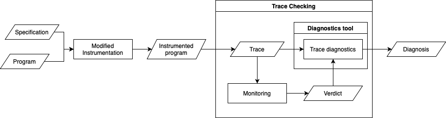

# iCFTL-Diagnostics 

iCFTL-Diagnostics is a tool proposed as part of the paper "Diagnosing Violations of Time-based Properties Captured in iCFTL", by Cristina Stratan, Joshua Heneage Dawes, and Domenico Bianculli, to be published as part of the proceedings of FormaliSE 2024.

## Tool Overview

iCFTL-Diagnostics is a tool that diagnoses violations of time-based properties captured in iCFTL. iCFTL-Diagnostics makes use of the SCSL toolchain, which consists of four packages SCFG, SCFGPython, SCSL and InstrumentPythonSCSL. iCFTL is a predecessor of SCSL, as such we can express iCFTL specifications using the same tool.

iCFTL-Diagnostics can be used to verify that a program conforms to an iCFTL specification. The verification process consists of three steps Instrumentation, Monitoring, and Trace checking. The architecture of iCFTL-Diagnostics can be seen below.



## Installation
The recommended **python version is 3.9**. Set up and activate a virtual environment with:
```
cd icftldiagnostics
python3 -m venv venv
source venv/bin/activate
```
The recommended way to install this package is using ```pip```.  Make sure to upgrade ```pip``` and ```setuptools``` with the following command.
```
pip install --upgrade pip setuptools
```
The packages (SCFG,SCFGPython, SCSL and InstrumentPythonSCSL) have to be installed using:
```
pip install -r requirements.txt
```
This command will also install the external packages
```graphviz ```, ```antlr4-python3-runtime==4.13.0``` and ``` code2flow==2.5.1```
## Usage

Given that we have a program in file ```test_program.py``` and the specification in file ```spec.scsl```, that captures for each change of ```x``` in program ```p``` that the time between the change of ```x``` and the next change of ```y``` is less than ```0.2```. This specification is violated and as such we want to obtain a diagnosis as to why this happened. 
In order to obtain a diagnosis as to why the specification was violated, you have to run several commands.


1. We start by instrumenting the programs that the specification is written over. Instrumentation helps us statically choose statements in the program that are relevant to the specification.
```
scsl-instrument spec.scsl . 
```
2. As the instrumentation code has been inserted in the program, we obtain a new ```test_program.py``` that has lines of code inserted that record timestamps of events (statements in the program). The original program is saved under ```test_program_uninstrumented.py```
```
python3 test_program.py
```
After running this command, the code will generate a trace in a JSON file ```scsl_trace.json```.

3. Finally, we perform trace checking, which will analyse the trace and generate our diagnosis. 
```
scsl-check-trace trace-0.json
```
The diagnosis will be available as a terminal output, but also a ```diagnosis-0.json``` file will be generated that contains tuples for each pair of false binding and false atomic constraint. Each tuple is formed of the false atomic constraint, false binding, length of the analysed trace, function name of the PNR, and the line number of the PNR.

 
